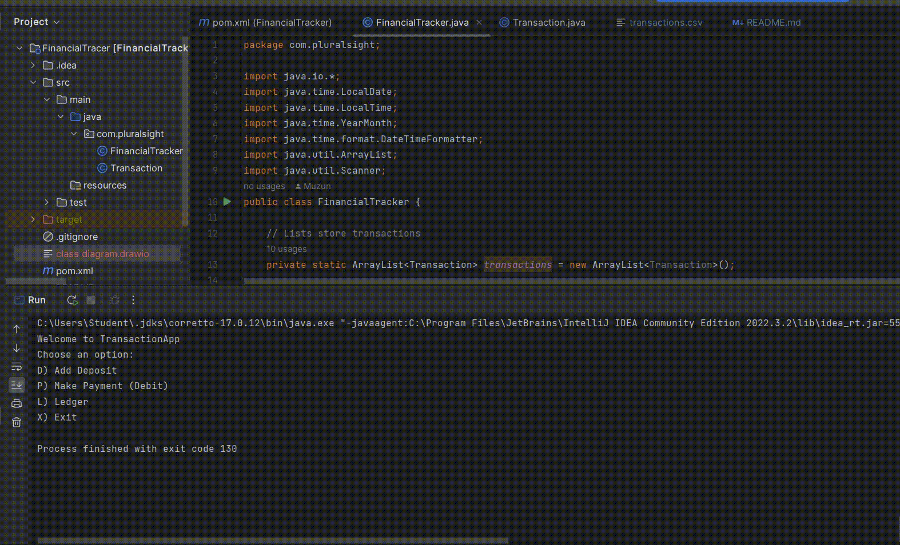
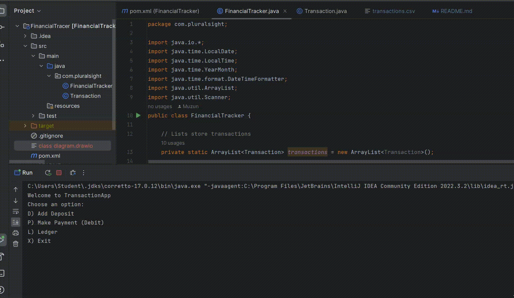

# Financial Tracker CLI Application

## Description of the Project

The Financial Tracker is a simple Java console application that allows users to track their financial transactions, including deposits, payments, and generate various reports. Users can record transactions with relevant details such as date, time, description, vendor, and amount. All data is stored in a `transactions.csv` file, which ensures persistence across sessions. This application can be used for personal finance or small business purposes.

## User Stories

- As a user, I want to input my deposits and payments, so that I can keep track of my finances.
- As a user, I want to see a summary of all my transactions, so that I can review my financial activity.
- As a user, I want to generate reports, so that I can easily track financial trends (e.g., month-to-date, previous month).
- As a user, I want to search by specific vendors, so I can review my spending with them.
- As a user, I want to perform custom searches on my transactions, so I can filter based on different criteria.

## Setup

Follow these instructions to set up and run the project using IntelliJ IDEA.

### Prerequisites

- **IntelliJ IDEA**: Make sure you have IntelliJ IDEA installed. You can download it from [here](https://www.jetbrains.com/idea/download/).
- **Java SDK**: Ensure that you have the Java SDK installed and configured in IntelliJ.

### Running the Application in IntelliJ

1. Open IntelliJ IDEA.
2. Select "Open" and navigate to the directory where you cloned or downloaded the project.
3. After the project opens, wait for IntelliJ to index the files and set up the project.
4. Find the main class with the `public static void main(String[] args)` method.
5. Right-click on the file and select 'Run `FinancialTracker.main()`' to start the application.

## Technologies Used

- **Java**: Version 11 (or any higher stable version)
- **CSV File Handling**: For persistent storage of transactions.

## Demo

Here are some screenshots of the application in action:

### Home Screen

### Ledger Screen

## Features

- **Add Deposit**: Users can add a deposit to the ledger, specifying details such as date, time, vendor, and amount.
- **Make Payment (Debit)**: Users can record payments or debits in the ledger.
- **View Ledger**: Users can view all transactions, filter by deposits, or view only payments.
- **Reports**: Predefined and custom reports allow users to analyze their financial transactions. Available reports include:
    - Month-to-date
    - Previous month
    - Year-to-date
    - Previous year
    - Search by vendor
    - Custom search (based on date, description, vendor, and amount)

## Future Work

- **GUI Interface**: Migrate the CLI application to a GUI interface using a Java framework like JavaFX or Swing.
- **Expense Categories**: Add support for categorizing transactions (e.g., "Food", "Utilities") to provide more insight into spending.
- **Budgeting**: Integrate budgeting functionality to allow users to set financial goals and track progress.

## Resources

- [Java Programming Documentation](https://docs.oracle.com/en/java/)
- [Effective Java by Joshua Bloch](https://www.example.com)

## Team Members

- **Mehmet Uzun** - Developer

## Thanks

- Special thanks to Raymond Maroun for the guidance and feedback throughout the project.
- Thanks to the [Pluralsight](https://www.pluralsight.com) team for providing this capstone project template.
